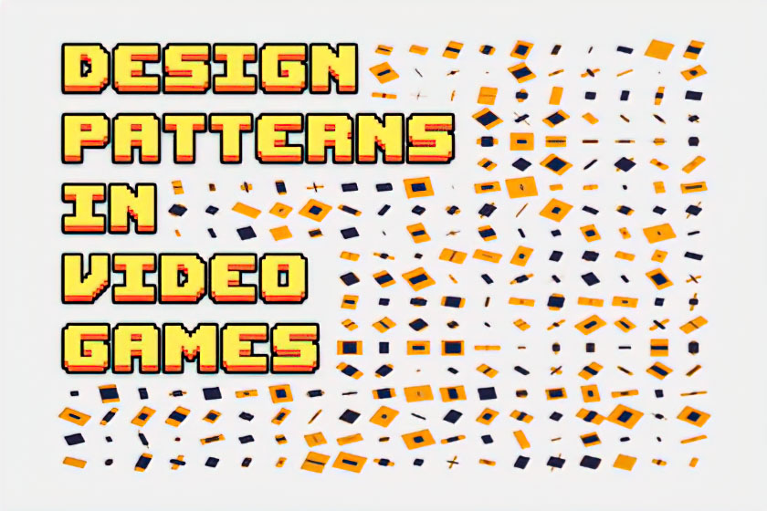

This repository contains the code of the tutorial series [Design patterns in video game development](https://www.nephasto.com/blog/design-patterns.html).

## Table of Contents
- [Installation](https://github.com/Nephasto/Design-patterns-in-game-development#installation)
- [Contents](https://github.com/Nephasto/Design-patterns-in-game-development#contents)
- [License](https://github.com/Nephasto/Design-patterns-in-game-development#license-scroll)

## Installation
Please follow the instructions in the manual about [Installing a package from a Git URL](https://docs.unity3d.com/Manual/upm-ui-giturl.html). 

Use the following URL to install the latest version of the package:
https://github.com/Nephasto/Design-patterns-in-game-development.git?path=/com.nephasto.design-patterns-in-game-development

## Contents

* Builders, patterns that create instances.
  * Singleton, guarantees that only a single instance of the class exists and provides global access to that instance.
* Structural, composition of classes and objects.
* Behavior, define interactions and responsibilities between classes and objects.

## License :scroll:

Code released under [the MIT License](https://github.com/Nephasto/Design-patterns-in-game-development/blob/main/LICENSE).